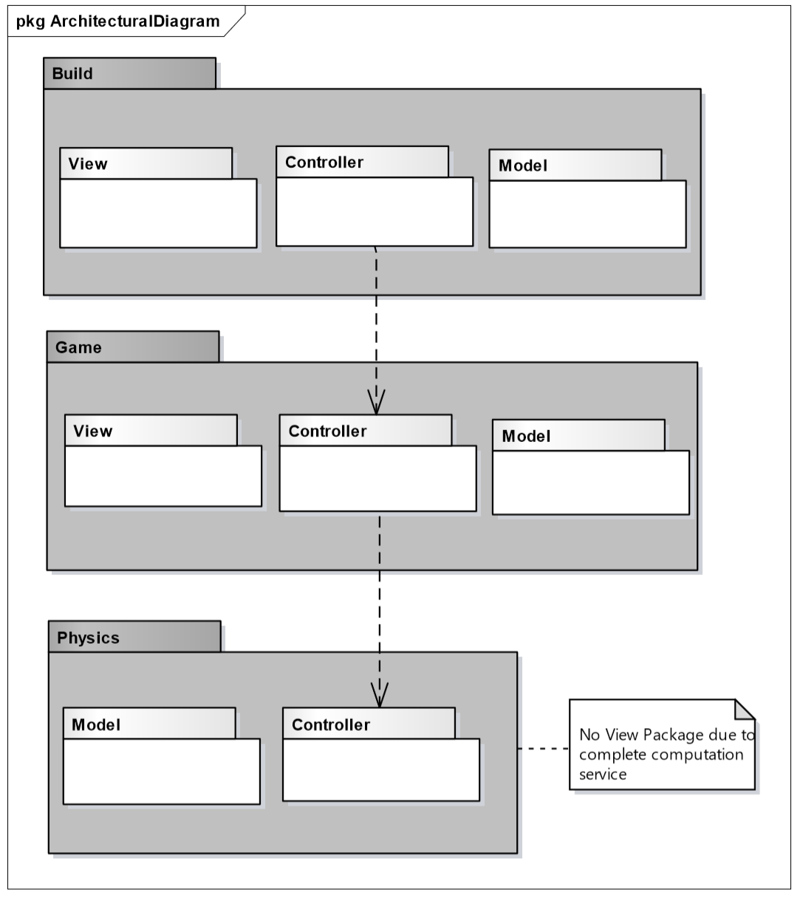
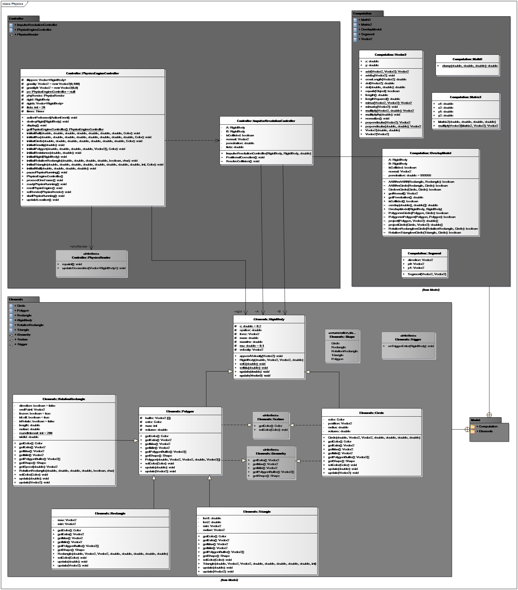
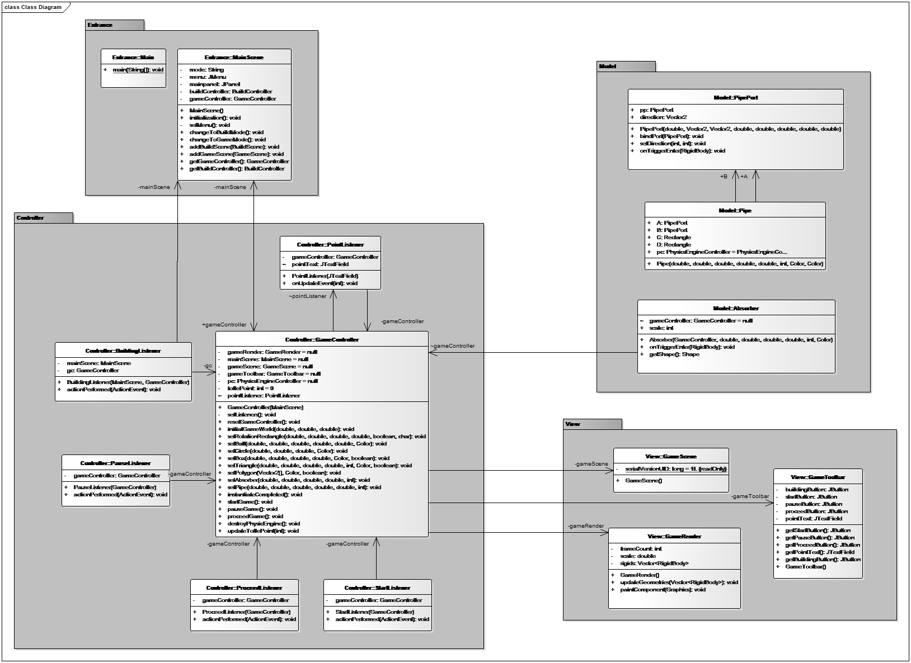
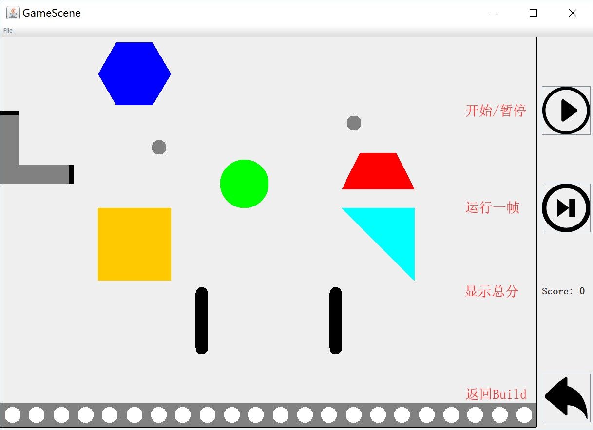
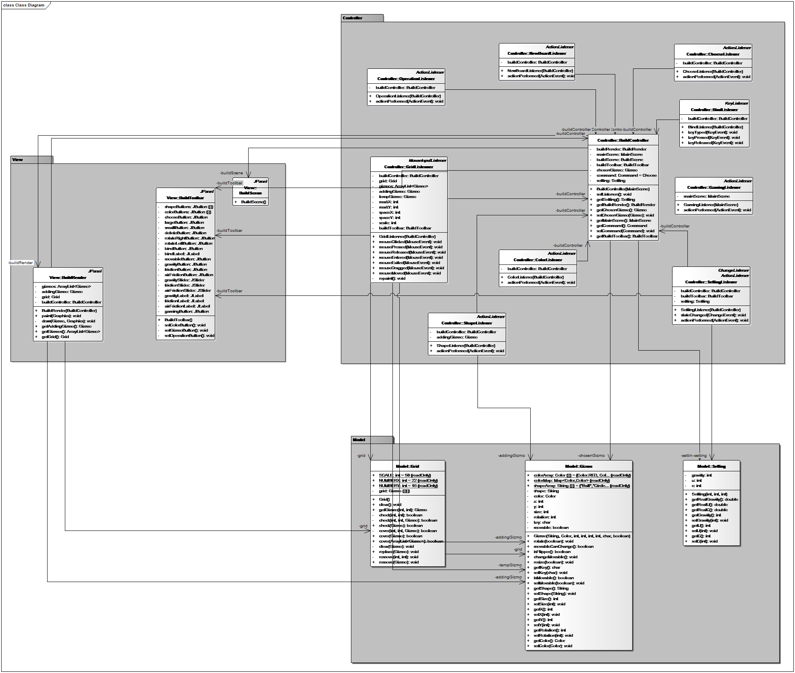
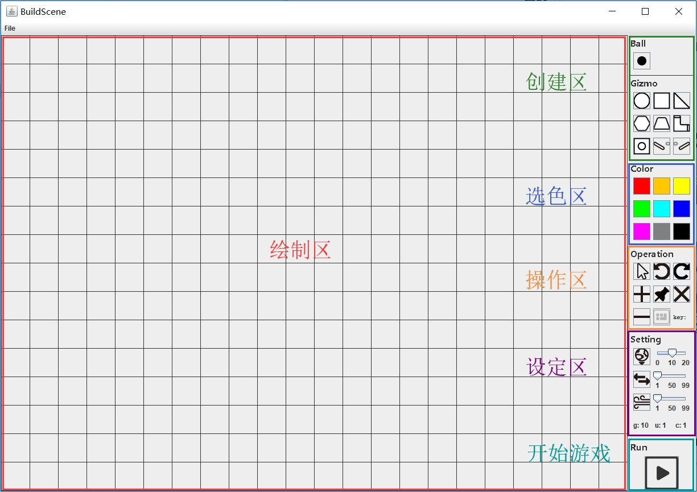
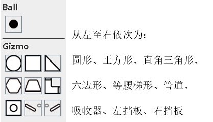
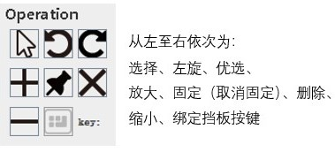
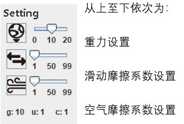

# OOAD-Gizmo
Object Oriented Analysis Design: Gizmo Game.
## Contributor
   - [ceej7](https://github.com/ceej7)
   - [lyx937131777](https://github.com/lyx937131777)
   - [vickiii7](https://github.com/vickiii7)    
## Architecture
Design the three-layer stucture with MVC pattern for apllication development and management. 

### 1. Physic Layer
Simulate a 2D physic based world including transition motion, trigger, resistance, collision(Algorithm SAT) and etc.  
For my more elaborate one, please turn to [SPEJ-Physics2D](https://github.com/ceej7/SPEJ-Physics2D)
- DCD

### 2. Game Layer
An instant game will be started. Rotate your flippers to hit the little balls. Once the ball is assimilated by the absorter, you simply win 1 score.
- DCD

- Demo

### 3. Build Layer
Build your gizmo game scene here with the provided tools.
- DCD

- Demo

- How to use  

## Note  
Reference-[SAT-Separating Axis Theorem](https://en.wikipedia.org/wiki/Hyperplane_separation_theorem)